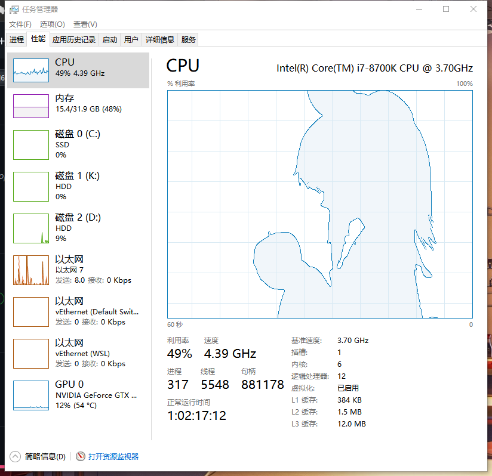

# TaskmgrPlayer
 >让你的任务管理器动起来

 

 这个程序原本是为了在任务管理器的CPU性能图上播放BadApple而写出来的
 经过一些改进之后, 现在可以在任何你想要的窗口上播放任何视频!

 ## config.cfg
通过配置config.cfg可以更改一些效果  
该文件默认使用utf8编码  
更改目标显示窗口需要了解Windows窗口的组成结构并学会使用Spy++来获得目标窗口的路径.  
播放的视频默认使用二值化后边缘检测的后处理, 想要实现其他效果需要自行修改代码并编译, 或者可以提交Issue, 我之后会添加.
颜色格式采用BGR格式

- WindowName 窗口标题
- WindowClass 窗口类
- ChildName 子窗口的类  使用了同一个类的租窗口, 默认选择最大的那一个
- ColorEdge 边缘的颜色
- ColorDark 二值化后黑色转换成的原色
- ColorBright 二值化后白色转换的颜色
- ColorGrid 背景网格的颜色
- ColorFrame 外围边框的颜色

## 其他
之后会在B站传一个视频教程(大概吧)
